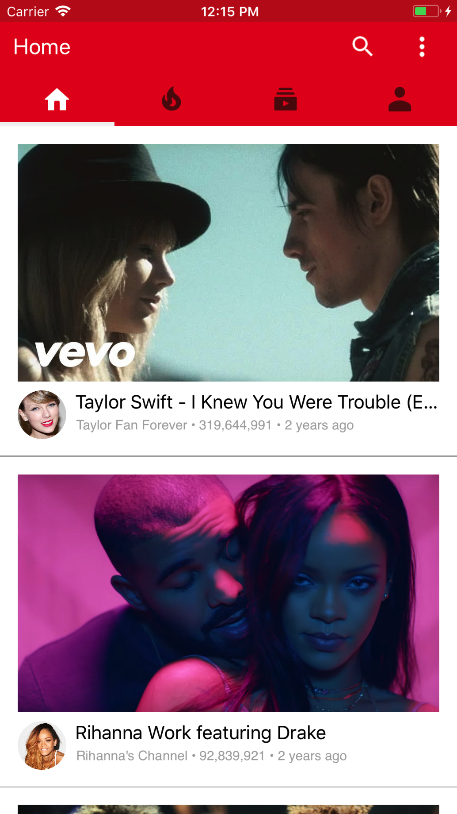
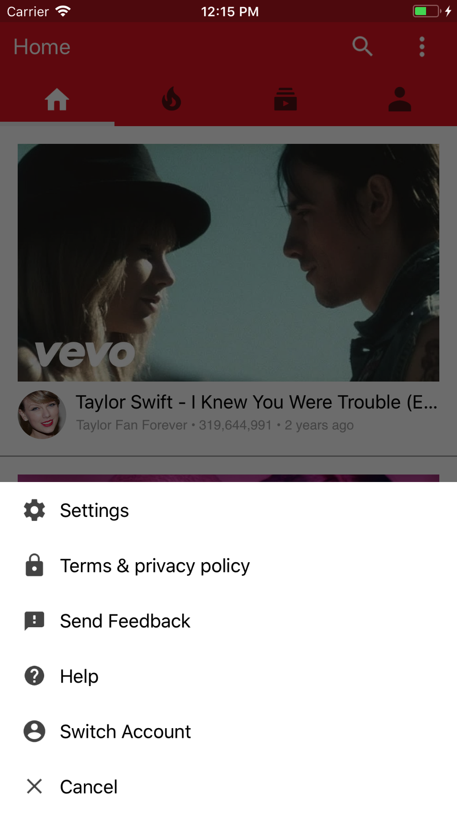
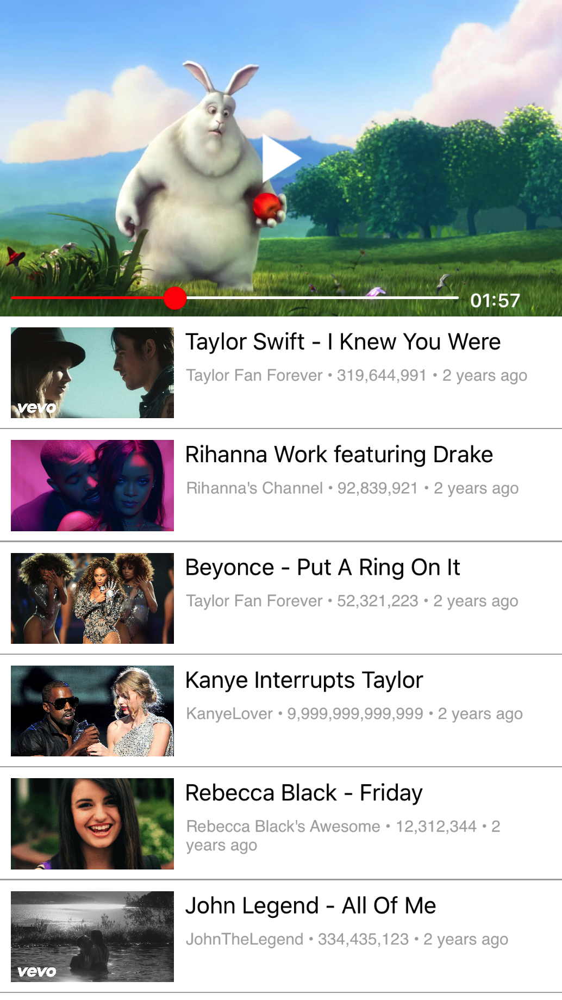

# YoutubeClone

## Features
:white_check_mark: Swift  
:white_check_mark: MVC architecture  
:white_check_mark: Video Player  
:white_check_mark: Custom Tab Menu  
:white_check_mark: Custom Slide Menu  
:white_check_mark: UI Programatically (No Storyboard)  

## Screens
| Home    | Slide Menu   | Video Player    | 
| :-------------: | :-------------: | :-------------: | 
|  |  |  |

## Tutorial
[Lets Build That App Channel](https://www.youtube.com/channel/UCuP2vJ6kRutQBfRmdcI92mA)

